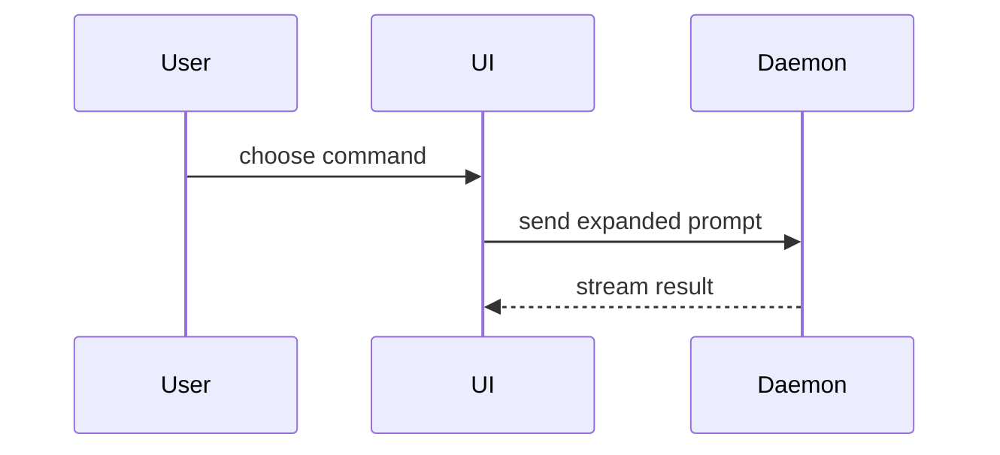

# show-me

Answer the current question with a picture of the code instead of a paragraph about it.

The skill is not "add a diagram". It is **pick the one smallest view that makes the
point, and let it carry the answer** — the prose around it shrinks to a caption.

## The shape of the answer

A show-me answer has exactly three parts, in this order:

1. One line naming what is being shown and at what scale.
2. The visual.
3. At most two sentences pointing at the part that answers the question.

That is the whole message. No preamble, no restating the question, no summary
paragraph underneath, no "let me know if you want more detail".

Use one form. Two when the question genuinely has two halves — a structure and a
flow through it. Never the whole catalogue.

## Pick the form

| The question is about | Form |
|---|---|
| logic, conditions, ordering | pseudocode |
| what calls what at runtime | call tree |
| UI structure, state, module boundaries | component tree |
| where responsibility lives, a broad refactor | file tree |
| interaction between components, over time | Mermaid |
| what **changes** in a shape that already exists | `diff` of any form above |
| a target shape the user will copy | full code block |
| layout, visual comparison, something too dense for text | one HTML page |

## The forms

**Pseudocode** — logic or an algorithm:

```text
on(save)
  if content is unchanged
    return cached result
  write new content
  return fresh result
```

**Call tree** — runtime control flow:

```text
submitForm
  createSession
    persistPrompt
    launchAgent
  navigateToSession
```

**Component tree** — UI structure, with the state and module boundaries that matter:

```tsx
<SessionPage> (apps/example/src/routes/session.tsx)
  useSessionEvents()
  <SessionToolbar>
    <RunSkillButton> (packages/ui)
```

**File tree** — where responsibility lives. Shallow, one comment per entry:

```text
src/
├── commands/       # parses user actions
├── sessions/       # owns session state
└── transport/      # sends API requests
```

**Mermaid** — interaction across components, or data flow over time:



## Diff, or the whole block

Use `diff` when the surrounding shape already exists and the user knows it — the
diff then says precisely what moves. Match the diff's shape to the topic: diff a
file tree for a layout change, a call tree for a control-flow change.

```diff
 submitForm
   createSession
     persistPrompt
+    expandSkillMention
     launchAgent
-  navigateToSession
+  navigateToSession
+    subscribeToEvents
```

```diff
 src/
 ├── commands/
+│   └── show-me.ts       # expands the slash command
 ├── sessions/
-└── transport.ts
+└── transport/
+    ├── client.ts
+    └── stream.ts
```

Show the whole block instead when most of it is new, when the omitted context
would hide ownership or order, or when the user needs a copyable target shape:

```ts
function expandSkill(command: string): string {
  const skillName = command.slice(1)
  return `use the ${skillName} skill`
}
```

## When text can't carry it

For a visual UI, a layout, a state comparison, or a concept too dense for Mermaid,
write **one** HTML file into the session scratchpad and open it:

```
Bash(open <scratchpad>/show-me-<topic>.html)
```

The page uses the product's own colors, type, spacing and components, real labels
and real data from the code at hand — never lorem, never placeholder boxes — and
works at desktop and phone width. A diagram, an infographic, or a short slide
deck, whichever fits the point; one of those, not all three.

This is the last resort, reached when a text form would lose the point — not the
default finish.

## Keep it small

Each visual sits next to the short text it supports, not in a gallery at the end.

Include only the calls, files, props, states and boundaries needed to answer the
question actually on the table, or to decide the point under discussion. Every
extra node makes the one that matters harder to find.

## Red flags — stop

- Opening with a paragraph of setup before the visual
- Producing three forms of the same thing so the user can choose
- A file tree or call tree that lists everything rather than the path in question
- Inventing plausible-looking names instead of reading the actual code first
- Writing an HTML page when a Mermaid diagram would have said it
- Adding a closing summary that repeats what the diagram already showed
